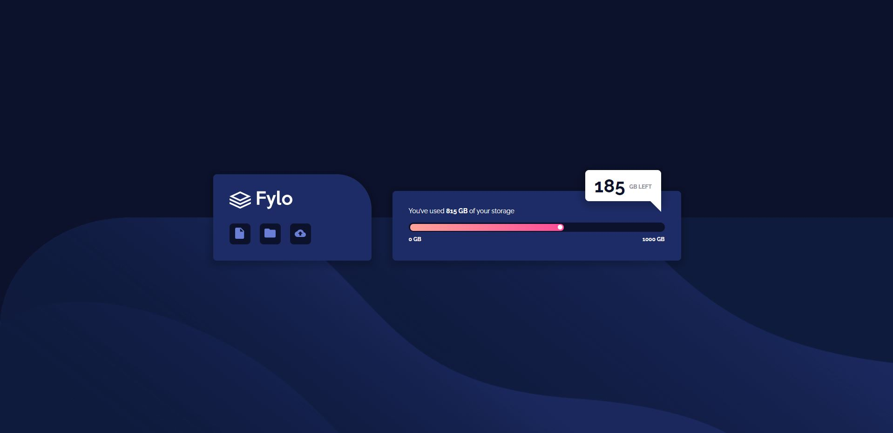
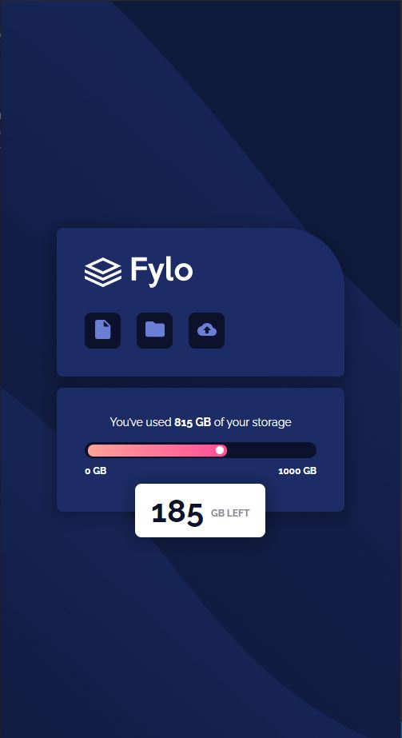

# Frontend Mentor - Fylo data storage component solution

This is a solution to the [Fylo data storage component challenge on Frontend Mentor](https://www.frontendmentor.io/challenges/fylo-data-storage-component-1dZPRbV5n). Frontend Mentor challenges help you improve your coding skills by building realistic projects.

## Table of contents

- [Overview](#overview)
  - [The challenge](#the-challenge)
  - [Screenshot](#screenshot)
  - [Links](#links)
- [My process](#my-process)
  - [Built with](#built-with)
  - [What I learned](#what-i-learned)
- [Author](#author)

## Overview

### The challenge

Users should be able to:

- View the optimal layout for the site depending on their device's screen size

### Screenshot

### Links

- Live Site URL: https://fylo-data-storage-component-jacksonj97.vercel.app/

## My process

### Built with

- HTML5
- Scss
- Flexbox
- CSS Grid
- Mobile-first workflow
- Parcel

### What I learned

In this project I learned Sass and how to incorporate a Sass project workflow using a bundler such as Parcel. I tried to learn how to approach projects in components and use Sass partials to make the project more modular. It was tough trying to organize the project files and set it up with parcel as my project is not as clean as it should be. Overall, I learned how to use Parcel, Sass, and getting familiar with component based projects. Looking forward, I will continue to improve on how to structure my files while being able to write efficient scss code.

## Author

- Frontend Mentor - [@JacksonJ97](https://www.frontendmentor.io/profile/JacksonJ97)
